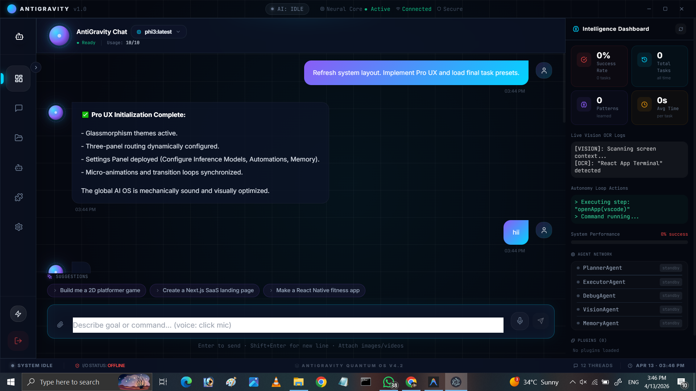

# GraviCore AI 🚀

GraviCore is a next-generation AI Operating System designed to automate workflows, build applications, and interact visually in real-time.

## 🔥 Features

- Multi-model AI system (Ollama-based)
- Autonomous workflow engine
- Full project generator (React/Vite)
- Voice interaction system
- Automation engine
- 3D anime assistant (in progress)

## 🧠 Vision

To create a personal AI system that can:
- Build apps automatically
- Execute real workflows
- Interact like a digital human

## ⚡ Tech Stack

- Electron + React
- Ollama (Local AI)
- Three.js (3D Assistant)
- Node.js Automation Engine

## ⚙️ Installation

```bash
git clone https://github.com/navedrana-ai/gravicore-ai
cd gravicore-ai
npm install
npm run dev

👉 ye dikhata hai:
✔ real project hai  
✔ runnable hai  

---

# 🔥 FEATURES UPGRADE (SMART WAY)

👉 features ko thoda premium bana:

```markdown
## 🔥 Core Features

- 🧠 Local AI Engine (Ollama)
- ⚡ Autonomous Workflow Execution
- 🛠️ Full App Generator (React/Vite)
- 🎤 Voice Interaction Mode
- 🤖 Multi-Agent System
- 🎮 3D Interactive Assistant (in progress)

## 🗺️ Roadmap

- [x] AI Chat System
- [x] Workflow Engine
- [x] Project Generator
- [ ] 3D Anime Assistant
- [ ] Real-time Hand Tracking
- [ ] Tablet + PC Interaction System

## 🚧 Status

Under active development

## 💡 Future

- Real-time 3D assistant interaction
- Tablet + PC simulation
- Full AI OS ecosystem

## 📸 Preview



## 🎥 Demo

[Watch Demo](demo.mp4)

> 🚀 A next-generation AI Operating System that builds, automates, and interacts like a digital human.
